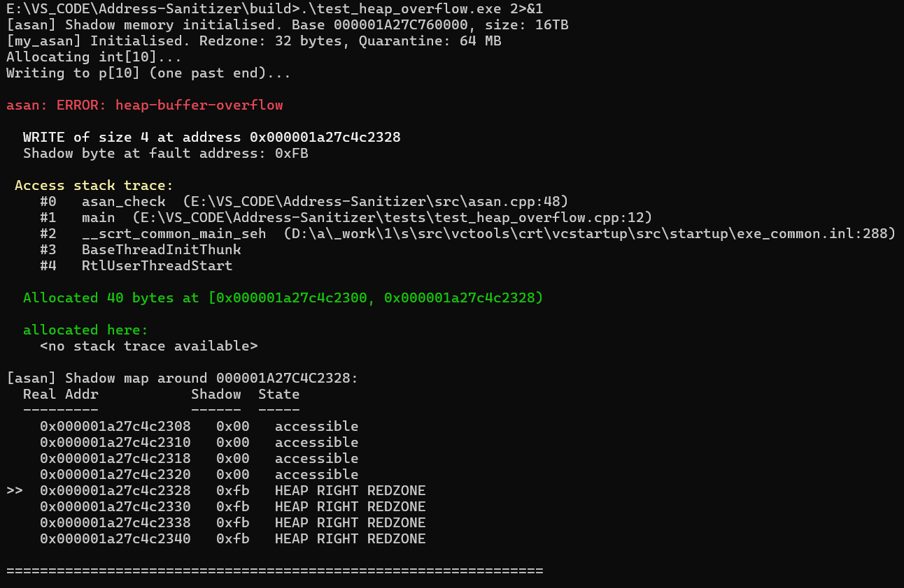
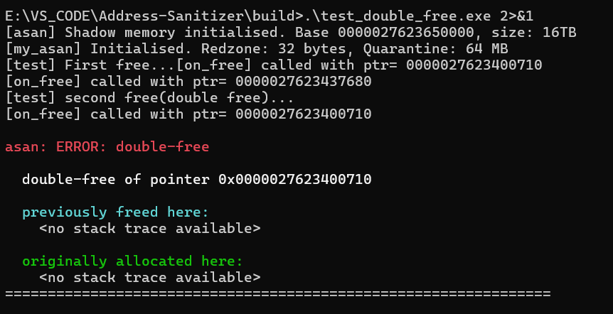
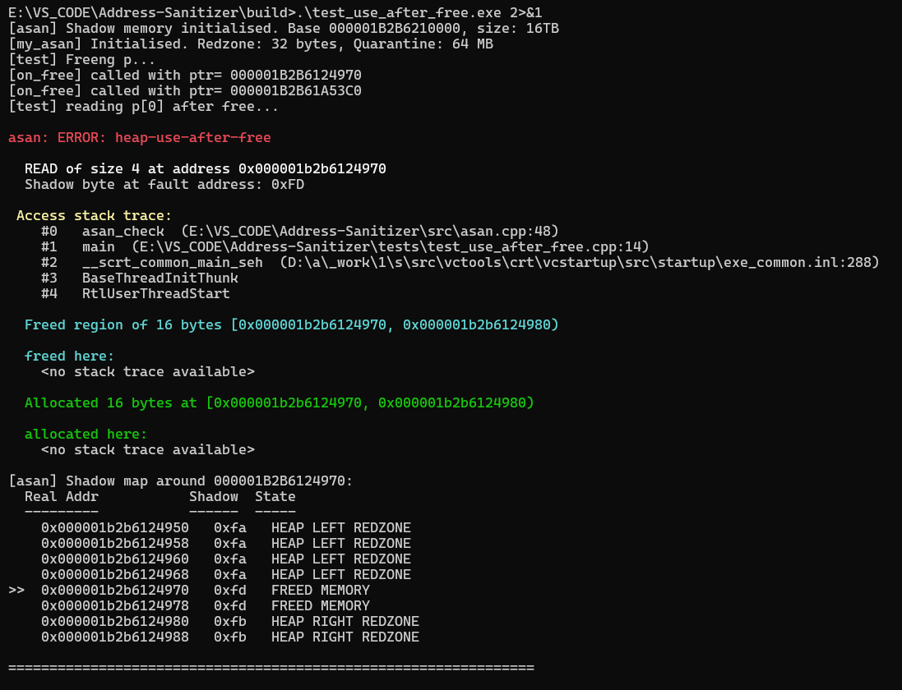
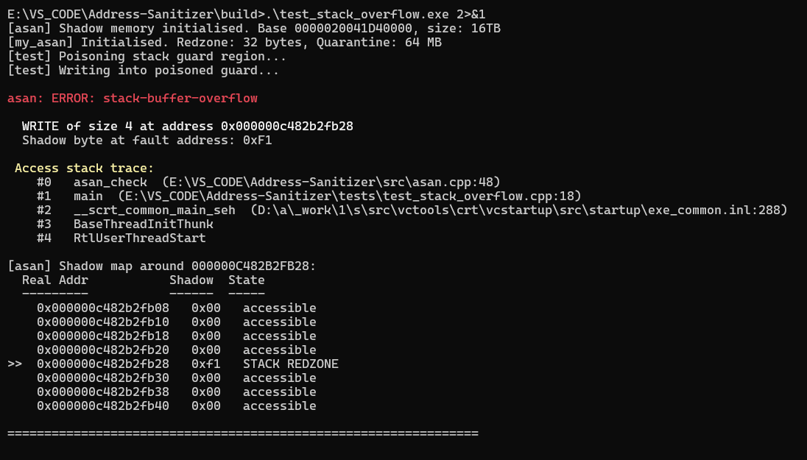

# Address Sanitizer(ASAN) 🔧

A from-scratch address sanitizer for 64-bit Windows, written in C++17.
 
ASAN detects memory safety violations at runtime: heap buffer overflows, use-after-free, double-free, and invalid-free and reports them with full stack traces, symbol resolution, and shadow memory context. It is built as a static library that you link into your project alongside a handful of compiler flags. 

## Table of Contents

- [What It Detects](#what-it-detects)
- [How It Works](#how-it-works)
  - [Shadow Memory](#shadow-memory)
  - [Heap Allocation Layout](#heap-allocation-layout)
  - [Quarantine](#quarantine)
  - [Instrumentation: Malloc and Operator Hooks](#instrumentation-malloc-and-operator-hooks)
  - [MSVC Function Hooks: /GH and /Gh](#msvc-function-hooks-gh-and-gh)
  - [Error Reporting](#error-reporting)
- [Public API](#public-api)
  - [Lifecycle](#lifecycle)
  - [Heap Wrappers](#heap-wrappers)
  - [Access Checks](#access-checks)
  - [Manual Poison / Unpoison](#manual-poison--unpoison)
  - [Reporting](#reporting)
  - [Configuration: asan_config.h](#configuration-asan_configh)
- [Building](#building)
  - [Requirements](#requirements)
  - [Build](#build)
  - [Run Tests](#run-tests)
  - [Compiling User Code](#compiling-user-code)
- [Quick Start](#quick-start)
  - [Sample Error Report](#sample-error-report)
  - [Terminal Outputs](#terminal-outputs)
    - [Heap Overflow](#heap-overflow)
    - [Double Free](#double-free)
    - [Use-after-free](#use-after-free)
    - [Stack Buffer Overflow](#stack-buffer-overflow)
- [Design Notes](#design-notes)
  - [Why MSVC Hooks Instead of an LLVM Pass](#why-msvc-hooks-instead-of-an-llvm-pass)
  - [Why a 16 TB Shadow Reservation](#why-a-16-tb-shadow-reservation)
  - [Why Quarantine Instead of Immediate Free](#why-quarantine-instead-of-immediate-free)
  - [Why Assembly for _penter/_pexit](#why-assembly-for-_penter_pexit)
- [Known Limitations](#known-limitations)
- [Acknowledgments](#acknowledgments)

## What It Detects
 
| Error | Description |
|-------|-------------|
| Heap buffer overflow | Read or write past the end (or before the start) of a heap allocation into a poisoned redzone |
| Use-after-free | Any access to memory that has already been freed detected while the block sits in quarantine |
| Double-free | Calling `free()` twice on the same pointer caught via the freed metadata map |
| Invalid free | Calling `free()` on a pointer that was never returned by `malloc`/`new`, or an interior pointer |
| Stack buffer overflow | Manual poison of stack regions via `asan_poison()`  `CHECK_READ`/`CHECK_WRITE` then catches violations |
 
--- 
## How It Works
 
### Shadow Memory
 
Every 8 bytes of real application memory maps to exactly 1 shadow byte using the formula:
 
```
shadow_addr = (real_addr >> 3) + shadow_base
```
 
On startup, my_asan reserves a 16 TB region of virtual address space via `VirtualAlloc(MEM_RESERVE)`. No physical memory is committed until shadow pages are first written, Windows lazily commits 64 KB-aligned chunks on demand, keeping actual RAM usage proportional to what the application touches.
 
Each shadow byte encodes the state of its corresponding 8-byte slot:

| Value | State | Meaning |
|-------|-------|---------|
| `0x00` | Accessible | All 8 bytes in this slot are valid |
| `0x01–0x07` | Partial | First N bytes valid, remainder poisoned (for odd-sized allocations) |
| `0xFA` | Heap left redzone | 32-byte guard region before the allocation |
| `0xFB` | Heap right redzone | 32-byte guard region after the allocation |
| `0xFD` | Freed / quarantined | Block has been freed and is held in quarantine |
| `0xF1` | Stack redzone | Manually poisoned stack guard region | 
### Heap Allocation Layout
Every allocation is padded with 32-byte redzones on both sides:
 
```
[ LEFT REDZONE (32b) | USER DATA (aligned to 8b) | RIGHT REDZONE (32b) ]
  0xFA ··· 0xFA      | 0x00 ··· 0x00             | 0xFB ··· 0xFB
```
 
Per-allocation metadata (`AllocInfo`) tracks the user pointer, requested size, full allocation pointer, total size including redzones, the allocation stack trace, the free stack trace, and whether the block has been freed.
 
### Quarantine
 
When `free()` is called, my_asan does not immediately return memory to the OS. Instead the freed block is:
 
1. Poisoned entirely with `0xFD` (freed memory marker)
2. Placed in a FIFO queue alongside its full `AllocInfo`
3. Held there until the total quarantine size exceeds 64 MB
4. Only then actually released to the OS via `::free()`
This creates a window during which any access to the freed pointer is detected. The larger the quarantine budget, the longer the detection window. The tradeoff is memory held deliberately beyond logical free.
 
### Instrumentation: Malloc and Operator Hooks
 
my_asan intercepts all heap activity through two hook files:
 
**`malloc_hooks.cpp`** overrides `malloc` / `calloc` / `realloc` / `free` at link time, routing them through `HeapTracker`. Opt-in macro redirection (`#define ASAN_REDIRECT_MALLOC`) is also available per-translation-unit.
 
**`operator_hooks.cpp`** defines global `operator new` / `operator delete` and all their variants: array, nothrow, and sized (C++14). The linker prefers these over the CRT defaults, so any `new`/`delete` in user code is automatically tracked alongside `malloc`/`free`. Both hook files route through the same `HeapTracker` singleton.
 
### MSVC Function Hooks: /GH and /Gh
 
Compiling user code with `/GH` and `/Gh` causes MSVC to inject calls to `_penter()` at the start and `_pexit()` at the end of every function. my_asan uses these to track per-thread call depth.
 
Because `_penter` is called before the instrumented function's own prologue has run before it saves any registers the implementation cannot be a normal C++ function. MSVC would generate a prologue that clobbers the caller's unsaved register state. The only correct approach is hand-written x64 MASM assembly that manually saves all volatile registers and CPU flags, calls the C++ handler, then restores everything before returning. The instrumented function is completely unaware that `_penter` ran.
 
> MSVC does not support inline `__asm` in 64-bit builds, which is why `_penter` and `_pexit` live in a separate `.asm` file assembled by `ml64.exe`.
 
`msvc_hooks.cpp` compiled without `/GH /Gh` to prevent recursive instrumentation provides the plain C++ handlers:
 
```cpp
void penter_handler() { ++tl_call_depth; }
void pexit_handler()  { --tl_call_depth; }
```
 
### Error Reporting
 
When a violation is detected, the error reporter:
 
1. Classifies the error type from the shadow byte and heap tracker metadata
2. Captures the current call stack via `CaptureStackBackTrace()`
3. Resolves frame addresses to function names and source file/line via `DbgHelp.dll`
4. Prints a colored report to stderr showing the error type, faulting address, access size, and access stack trace
5. Prints the original allocation stack trace and free stack trace (for use-after-free / double-free)
6. Dumps the shadow memory map around the fault address for context
7. Calls `abort()` (configurable via `ASAN_ABORT_ON_ERROR`)
---
 
## Public API
User code only ever needs to include `asan.h`. Nothing from `src/` is part of the public interface.
 
### Lifecycle
 
```cpp
void asan_init();        // Reserve shadow memory, init DbgHelp, reset call depth.
                         // Call once before any instrumented allocation.
 
void asan_shutdown();    // Flush quarantine, print summary, release shadow memory.
```
 
### Heap Wrappers
 
```cpp
SAFE_MALLOC(T, n)        // Typed tracked allocation  int* p = SAFE_MALLOC(int, 10);
SAFE_CALLOC(T, n)        // Typed zero-initialised allocation
SAFE_FREE(ptr)           // Tracked free poisons region, enqueues in quarantine
SAFE_NEW(T, ...)         // Placement new through asan_malloc
SAFE_DELETE(ptr)         // Calls destructor, then asan_free, sets ptr to nullptr
 
asan_malloc(size)        // Raw tracked malloc
asan_calloc(count, size) // Raw tracked calloc
asan_realloc(ptr, size)  // Tracked realloc: malloc new, copy, free old
asan_free(ptr)           // Raw tracked free
```
 
### Access Checks
 
```cpp
CHECK_READ(ptr, size)    // Verify [ptr, ptr+size) is readable
CHECK_WRITE(ptr, size)   // Verify [ptr, ptr+size) is writable
 
//used internally by CHECK_READ / CHECK_WRITE
void asan_check(uintptr_t addr, size_t size, bool is_write);
```
 
### Manual Poison / Unpoison
 
```cpp
// For custom allocators or manual stack instrumentation
asan_poison(ptr, size, value)         // size must be multiple of 8
asan_poison_partial(ptr, size, value) // any size handles trailing partial slot
asan_unpoison(ptr, size)              // mark region fully accessible
 
// Shadow byte constants
ASAN_POISON_HEAP_LEFT_REDZONE    // 0xFA
ASAN_POISON_HEAP_RIGHT_REDZONE   // 0xFB
ASAN_POISON_FREED                // 0xFD
ASAN_POISON_STACK_REDZONE        // 0xF1
```
 
### Reporting
 
```cpp
void asan_report_summary();   // Print total error count to stderr
int  asan_error_count();      // Return number of errors detected so far
```
 
### Configuration: asan_config.h
 
Override any of these before including `asan.h`:
 
```cpp
#define ASAN_REDZONE_SIZE           32        // Bytes before/after each allocation. Must be multiple of 8.
#define ASAN_QUARANTINE_MAX_BYTES   67108864  // 64 MB — max bytes held in quarantine
#define ASAN_MAX_STACK_FRAMES       32        // Max frames captured per stack trace
#define ASAN_ABORT_ON_ERROR         1         // abort() after first error report
#define ASAN_PRINT_SHADOW_CONTEXT   1         // Dump shadow map around fault in reports
#define ASAN_SHADOW_CONTEXT_BYTES   32        // Shadow context bytes printed each side
#define ASAN_ENABLE_HEAP_CHECK      1         // Enable heap checking (0 = zero overhead)
#define ASAN_ENABLE_STACK_CHECK     0         // Stack variable poisoning (experimental)
#define ASAN_ENABLE_MSVC_HOOKS      1         // Reserved for /GH /Gh call depth tracking (currently disabled at the build level)
```
---
 
## Building
 
### Requirements
 
- Windows 10 or later (64-bit)
- Visual Studio 2022 — provides `cl.exe` (MSVC) and `ml64.exe` (MASM)
- CMake 3.20 or later
- Ninja (generator)
- Windows SDK — provides `DbgHelp.lib` and `DbgHelp.dll`
> **Generator note:** If Visual Studio is installed on a non-default drive/path, the `"Visual Studio 17 2022"` CMake generator may fail to locate the instance. Using `Ninja` from an **x64 Native Tools Command Prompt for VS 2022** sidesteps this entirely, since Ninja just uses whatever `cl.exe` / `ml64.exe` are already on `PATH`.
 
### Build
 
```bat
mkdir build && cd build
cmake .. -G "Ninja" -DCMAKE_BUILD_TYPE=RelWithDebInfo
cmake --build .
```
 
> `RelWithDebInfo` is used instead of `Debug` to avoid linking against MSVC's debug CRT (`/MDd`), which has its own internal heap instrumentation that conflicts with ASAN's allocator hooks. `RelWithDebInfo` keeps full `/Zi` debug symbols for stack traces while linking the release CRT (`/MD`).
 
### Run Tests
 
```bat
ctest --output-on-failure
```
 
`test_clean` is expected to pass with zero errors. The four error tests (`heap_overflow`, `use_after_free`, `double_free`, `stack_overflow`) are marked `WILL_FAIL` in CMake as they are treated as passing when they `abort()`.
 
### Compiling User Code
 
```bat
cl /Zi /Od /I path\to\include user_code.cpp asan.lib DbgHelp.lib /link /DEBUG
```
 
| Flag | Purpose |
|------|---------|
| `/Zi` | Generate full debug info (.pdb) for DbgHelp symbol resolution |
| `/Od` | Disable optimisations (recommended during development) |
| `/DEBUG` | Embed PDB path in the binary so DbgHelp can find it at runtime |
 
> **`/GH` and `/Gh` are currently disabled.** Enabling them injects `_penter`/`_pexit` calls into CRT startup code itself, before `asan_init()` has run, which causes a crash during process startup. The call-depth tracking these flags enable is not required for heap detection (shadow memory, redzones, quarantine) to work it is reserved for future stack-frame instrumentation. See [Known Limitations](#known-limitations).
 
---
 
## Quick Start
 
```cpp
#include "asan.h"
 
int main() {
    asan_init();
 
    // Tracked allocation redzones poisoned automatically
    int* arr = SAFE_MALLOC(int, 10);
 
    // Instrument accesses
    for (int i = 0; i < 10; ++i) {
        CHECK_WRITE(&arr[i], sizeof(int));
        arr[i] = i;
    }
 
    // Heap buffer overflow caught by CHECK_WRITE
    CHECK_WRITE(&arr[10], sizeof(int));
 
    SAFE_FREE(arr);
    asan_shutdown();
    return 0;
}
```
 
### Sample Error Report
 
```
================================================================
  asan: ERROR: heap-buffer-overflow
================================================================
  WRITE of size 4 at address 0x00000213A4C80068
  Shadow byte at fault address: 0xFB
 
  Access stack trace:
    #0  main  (example.cpp:14)
 
  Allocated 40 bytes at [0x00000213A4C80040, 0x00000213A4C80068)
 
  allocated here:
    #0  HeapTracker::on_malloc  (heap_tracker.cpp:52)
    #1  asan_malloc             (asan.cpp:44)
    #2  main                    (example.cpp:10)
================================================================
```
## Terminal outputs: 

### Heap Overflow


### Double free

 
### Use-after-free


### Stack Buffer overflow



## Design Notes
 
### Why MSVC hooks instead of an LLVM pass
 
A real ASan uses an LLVM IR pass to instrument every load/store at compile time. On 64-bit Windows this requires building LLVM from source (~30 GB, 1–2 hours) and navigating plugin ABI friction between MSVC and Clang. The `/GH /Gh` approach is native to the Windows toolchain, requires no external dependencies, and gives real compiler-level instrumentation without the setup cost.
 
### Why a 16 TB shadow reservation
 
64-bit Windows user space spans 2^47 bytes (128 TB). Dividing by 8 (shadow granularity) gives 16 TB of shadow. `VirtualAlloc(MEM_RESERVE)` stakes the address space without consuming physical memory pages are committed lazily in 64 KB chunks on first write. Actual RAM usage stays proportional to what the application touches.
 
### Why quarantine instead of immediate free
 
Returning freed memory to the OS immediately removes the shadow poison from that address range. A subsequent use-after-free on that address would go undetected. Quarantine keeps the block alive and poisoned for as long as the budget allows, maximising the detection window for temporal memory safety bugs.
 
### Why assembly for _penter/_pexit
 
MSVC does not support inline `__asm` in 64-bit builds. The `_penter` call is injected before the instrumented function's own prologue, meaning no registers have been saved yet. A C++ `_penter` would corrupt those unsaved values. The correct solution is a hand-written MASM stub that saves all volatile registers and CPU flags, calls the C++ handler, then restores everything before returning.
 
---
 
## Known Limitations
 
- **`/GH /Gh` are disabled by default.** Enabling them causes MSVC to inject `_penter`/`_pexit` calls into CRT startup code before `asan_init()` runs, crashing the process before `main()` is reached. Call-depth tracking via these hooks is implemented (`msvc_hooks.asm` + `msvc_hooks.cpp`) and compiles/links correctly, but is not enabled in the default build configuration.
- Allocations made before `asan_init()` e.g. from global constructors fall through to raw `malloc` and are not tracked.
- The freed metadata map is capped at 4096 entries. Very old freed pointers may not be recognised in double-free reports.
- Overflow detection on allocations whose size is not a multiple of 8 may not catch accesses that land within the alignment padding rather than the redzone proper (e.g. a 10-byte allocation rounds to 16 bytes of addressable user space before the redzone begins). Allocations sized as multiples of 8 are unaffected.
- Stack variable checking (`ASAN_ENABLE_STACK_CHECK`) is a stub the compiler does not expose frame size metadata through `_penter`.
- No support for 32-bit targets. Shadow memory layout assumes the 48-bit x64 address space.
- `win32_memory` platform wrappers do not yet support huge-page allocation.

## Acknowledgments
This project was inspired by encountering Address Sanitizer reports while solving LeetCode problems. 